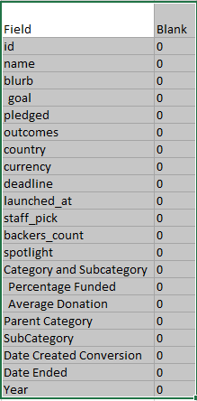

#Original Template Text

# Kickstarting with Excel

## Overview of Project

### Purpose

## Analysis and Challenges

### Analysis of Outcomes Based on Launch Date

### Analysis of Outcomes Based on Goals

### Challenges and Difficulties Encountered

## Results

- What are two conclusions you can draw about the Outcomes based on Launch Date?

- What can you conclude about the Outcomes based on Goals?

- What are some limitations of this dataset?

- What are some other possible tables and/or graphs that we could create?

# Kickstarting with Excel

## Overview of Project
~~Explain the purpose of this analysis.~~

### Purpose
My customer for this analysis is Louise. Louise is committed to creating a play in the U.S. using Kickstarter funding. On behalf of Louise I was asked to do an analysis of an available dataset regarding historical Kickstarter funding campaigns in order to provide Louise with guidance as to what she may do to optimize the chances of a successful funding campaign. Of particular interest to the client are insights regarding how much funding to seek and whether the time of year (month) of launch influences the outcome. Further, I am to give her my assessment of limitations of the data set and this analysis with recommendations of possible extensions or enhancements to this work. 

### Background
The data set that was provided by the client for analysis is a spreadsheet of historic results Kickstarter funding efforts from 21 countries covering a time period from 8/2009 through 5/2017. The dataset consists of 4,114 records. Each record/campaign includes specification of a Category and Sub-category type. Thare are 9 discrete Categories (film & video, music, publishing, technology, games, photography, theater, food, and journalism) further broken down into a total of 41 subcategories. Subcategory total campaign numbers range from 20 (10 unique sub-categories) to 1,066 (plays, the subcategory of interest to Louise). Other record attributes include total pledges, number of pledges, the dates of opening/closing of the campaigns, and others See the full list of fields in the Addendum. 

## Analysis and Challenges
~~Explain how you performed your analysis using images and links to code, as well as any challenges you encountered and how you overcame them. If you had no challenges, describe any possible challenges or difficulties that could be encountered.The overview of the analysis is well described with screenshots (2 pt).
Challenges or difficulties that were encountered, and how they were overcome, are well explained. If there were no difficulties, describe any possible challenges or difficulties that could be encountered (2 pt).~~

The analysis was performed in the following phases: 
* The data was provided as an excel spreadsheet. Using simple filters on each field the structure, content, consistency, and completeness of the data was assessed.

     RESULT: The data was found to be quite clean with no missing data and consistent data entry. 
     
     

* Individual columns/fields were reviewed, summarized, and ammended as necessary. Counts of the unique entries for Country, Category, Sub-category, and Country were performed.

     RESULT: Limited data sets for many Countries and for many Category/Subcatetories were noted. Date/Time fields were converted. 
     
     
    ![Number and percent by Country.]

* Additional calculated Field requirements wer identified and performed.

     RESULT: Added fields: Duration (deadline - launch); Percentage Funded (pledged / goal); average_donation (backers_count / pledged)

* A pivot-table was constructed and used to do a high-level overview of a variety of permutations seeking any overarching insights into the breadth, depth, and consistency of the data. 

     RESULT: Appropriateness of the clients initial focus on the attributes of funding amount and Launch Date (rolled up by month) were confirmed. Additional helpful analyses were identified. (See below - Result #4.)

* Specific analyses requested by the Client were performed. 

RESULT: See below. 

### Analysis of Outcomes Based on Launch Date

### Analysis of Outcomes Based on Goals

### Challenges and Difficulties Encountered

## Results

### Result #1
- What are two conclusions you can draw about the Outcomes based on Launch Date?

1. Total campaigns are fairly steady through the year with the exceptions of a spike in May/June/July and a significant drop off in December. The NUMBER of failed campaigns is fairly constant so a surge in successful campaigns launched during the May/June/July period reflects a receptivity of the funders to submissions during this time. 
2. Even in the WORST month with respect to the number of successful campaigns (December) there is still an equal number of successful campaigns to failed campaigns. Additonal attributes of these campaigns are needed to determine whether there are compelling reasons to consider an effort launched in this timeframe. (This is true of many of the takeaways from this analysis. See Result #4 below.)

### Result #2
- What can you conclude about the Outcomes based on Goals?

1. In general, there is a trend toward lower success rates with higher goals. That makes intutive sense but must be interpreted in light of the next point. 
2. Counter to the trend described above, there appears to be a "sweet-spot" with respect to successful funding in the $35k to $50k range where success percentages of 70% to 80% encountered. This needs to be examined further to determine whether other factors can be found that might explain this counter-trend. 
3. Apparent anomolies such as 100% success for campaigns with goals of $45 to $50k must be scrutized closely as they can represent outliers. In this case it is a single campaign that was successful. 

### Result #3
- What are some limitations of this dataset?

1. pledged and backer_count totals do not provide significant insight into the nature of the backers; i.e. whether many small pledges or a few major pledges represent the greatest opportunity. This has implications on how to package and present the opportunity. Individual donor records or statistical analysis of such data could be impactful on decision-making. 
2. Some fields of the data set are not defined (staff_pick (T/F) and spotlight (T/F)). These may represent impactful attributes that could influence campaign decisions.
3. Multi-factorial analysis of the data set quickly results in "cohorts" that are too small to provide statistically meaningful results. Larger data sets can address this to some degree. If some of the ideas regarding further analysis of this data set are pursued, it is important to be watchful for the creation of data that my not meet minimum standards of statistical significance. (Be careful not to over-analyze this and any other dataset.)

### Result #4

What are some other possible tables and/or graphs that we could create?
- Parallel / independent analysis of the influence of staff-pick and spotlight
- Influence of Year separate and distinct from Month. 
- Correlation of backers_count with other factors

### Additional Concerns noted:
1. Foundational concerns with the veractity of the data set. I have no ability to speak to the quality of the data. 
2. It is not clear how the data set addresses currency exchanges and identification of cross-border funding. This analysis assumes that these issues were addressed in the original collection / creation of the data set. 

## Addenda

### data fields
1. id
2. name
3. blurb
4. goal
5. pledged
6. outcomes
7. country
8. currency
9. deadline
10. launched_at
11. staff_pick
12. backers_count
13. spotlight
14. Category and Subcategory
15. Percentage Funded
16. Average Donation
17. Parent Category
18. SubCategory
19. Date Created Conversion
20. Date Ended
21. Year

